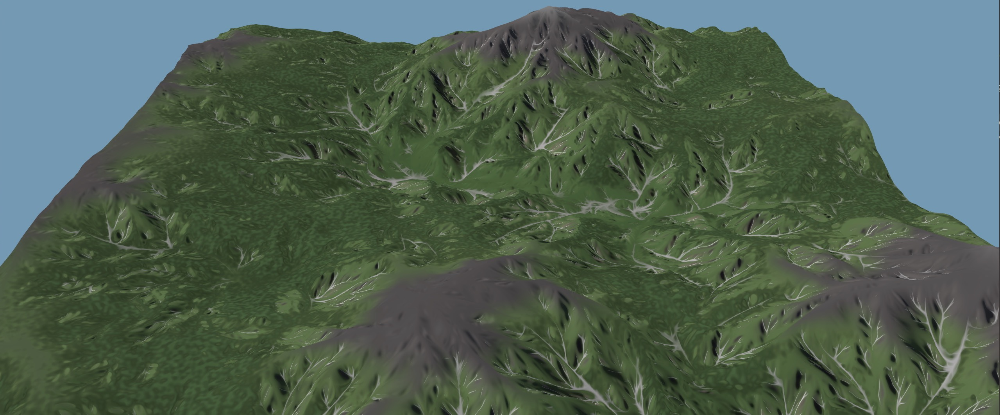

# bevy_erosion_filter

[](https://github.com/korbindeman/bevy_erosion_filter/actions/workflows/ci.yml)
[](https://crates.io/crates/bevy_erosion_filter)
[](https://docs.rs/bevy_erosion_filter)

A GPU-friendly per-fragment erosion filter for Bevy. Adds branched gully detail to any heightfield analytically: no neighbour reads, no simulation, parallel across fragments, evaluable in chunks. Works as a sub-pixel detail layer on baked terrain or the high-frequency pass of a per-fragment procedural surface.

Ported from Rune Skovbo Johansen's *Advanced Terrain Erosion Filter*
([blog](https://blog.runevision.com/2026/03/fast-and-gorgeous-erosion-filter.html) ·
[Shadertoy](https://www.shadertoy.com/view/wXcfWn)),
which builds on prior work by Fewes, Clay John, and Inigo Quilez. See
[`THIRD-PARTY-NOTICES.md`](./THIRD-PARTY-NOTICES.md).



## How it works

The filter overlays multi-octave gully patterns aligned to the steepest-descent direction. Each octave's slope feeds the next, so smaller gullies branch off larger ones. At any zoom level it looks like erosion; neighbouring gullies don't connect into real drainage networks.

## Bevy compatibility

Tracks released Bevy versions. MSRV: Rust 1.89.

| `bevy_erosion_filter` | `bevy` |
|---|---|
| `0.1` | `0.18` |

## Cargo features

| Feature | Default | Description |
|---|---|---|
| `bevy` | yes | Enables `ErosionFilterPlugin` and `ErosionFilterParamsGpu`. Disable with `default-features = false` to use only the pure-Rust [`cpu`](https://docs.rs/bevy_erosion_filter/latest/bevy_erosion_filter/cpu/index.html) module from non-Bevy crates (offline baking, build tools, other engines). |

## Install

```toml
[dependencies]
bevy = "0.18"
bevy_erosion_filter = "0.1"
```

Without Bevy (CPU-only):

```toml
[dependencies]
bevy_erosion_filter = { version = "0.1", default-features = false }
```

Add the plugin to your `App`:

```rust
use bevy::prelude::*;
use bevy_erosion_filter::ErosionFilterPlugin;

App::new()
    .add_plugins(DefaultPlugins)
    .add_plugins(ErosionFilterPlugin)
    .run();
```

`ErosionFilterPlugin` registers the WGSL file as a shader library at startup. Without it the `#import bevy_erosion_filter::erosion::...` path won't resolve and Bevy will emit a shader import error.

## Run the example

```sh
cargo run --example terrain_demo
```

The demo renders a procedural terrain with live egui sliders for all filter parameters and four visualization modes: **Terrain**, **ErosionDelta**, **RidgeMap**, and **DebugFade**.

## Platform support

Tested on native desktop. The shader is plain WGSL and works anywhere Bevy compiles your material, including WASM/WebGPU; WASM and WebGL2 are untested. `terrain_demo` targets native desktop.

## Use it from your own shader

```wgsl
#import bevy_erosion_filter::erosion::{
    fbm, erosion_filter, erosion_filter_params_default,
}

@fragment
fn fragment(in: VertexOutput) -> @location(0) vec4<f32> {
    // Your own height function returning vec3(height, d/dx, d/dy):
    let base = fbm(in.uv, 3.0, 4, 2.0, 0.5);
    let fade_target = clamp(base.x / 0.1, -1.0, 1.0);
    let filtered = erosion_filter(
        in.uv,
        base,
        fade_target,
        erosion_filter_params_default(),
    );

    let eroded = base + filtered.delta;
    let height = eroded.x;
    let normal = normalize(vec3<f32>(-eroded.y, -eroded.z, 1.0));
    let drainage = 1.0 - clamp(filtered.ridge_map, 0.0, 1.0);
    // … shade with `height` and `normal`.
    return vec4<f32>(height, normal.x * 0.5 + 0.5, drainage, 1.0);
}
```

Exported WGSL symbols:

| Symbol | What it does |
|---|---|
| `phacelle_noise(p, dir, freq, offset, norm) -> vec4` | Phase + cell stripe pattern aligned with `dir`. Building block of `erosion_filter`. |
| `erosion_filter(p, base, fade_target, params) -> ErosionFilterResult` | Raw advanced filter: adds rounding/onset/assumed-slope masking and outputs a **ridge map** for drainage paint and tree placement. |
| `erosion_filter_params_default() -> ErosionFilterParams` | Defaults matching the Shadertoy demo. |
| `fbm(p, freq, oct, lac, gain) -> vec3` | IQ analytical-derivative fBm, suitable as the base height. |
| `noised(p) -> vec3` | IQ gradient noise with derivatives (the building block of `fbm`). |
| `ErosionFilterParams` | Raw advanced parameter struct. |
| `ErosionFilterResult` | Height/slope delta (`delta`), accumulated strength (`magnitude`), ridge/drainage mask (`ridge_map`), and post-octave fade target (`debug`, the DebugFade visualization channel). |

Call `phacelle_noise` directly when you want only the stripe pattern without the full multi-octave erosion stack, for example a single-frequency gully mask:

```wgsl
#import bevy_erosion_filter::erosion::phacelle_noise

let slope_dir = normalize(vec2<f32>(-dpdx(height), -dpdy(height)));
let cell = phacelle_noise(in.uv, slope_dir, 0.7, 0.0, 0.5);
// cell.x is the stripe value; cell.yz are its derivatives.
```

## Pass parameters as a GPU uniform

`ErosionFilterParamsGpu` is a `ShaderType`-derived struct that mirrors the WGSL `ErosionFilterParams` layout for use with Bevy's render pipeline. Use it when you need to drive the filter from a bind group rather than hard-coding parameters in WGSL:

```rust
use bevy_erosion_filter::{cpu::ErosionFilterParams, ErosionFilterParamsGpu};

let params = ErosionFilterParamsGpu::from_cpu(&ErosionFilterParams::default());
// Write `params` into a uniform buffer and bind it in your material.
```

`ErosionFilterParamsGpu::default()` produces the same values as `erosion_filter_params_default()` in WGSL.

## Use the WGSL outside Bevy

If you're driving `wgpu` (or another backend) directly — for example an
offline bake CLI that runs compute pipelines without a Bevy `App` — the
shader source is exposed as a `&'static str` constant. It's available with
or without the `bevy` feature:

```rust
let module = device.create_shader_module(wgpu::ShaderModuleDescriptor {
    label: Some("erosion"),
    source: wgpu::ShaderSource::Wgsl(bevy_erosion_filter::EROSION_WGSL.into()),
});
```

The constant is the same WGSL `ErosionFilterPlugin` registers as a shader
library at runtime.

## Use it from Rust (CPU)

`bevy_erosion_filter::cpu` mirrors the same algorithm in pure Rust, useful for offline baking and parity tests:

```rust
use bevy_erosion_filter::cpu;
use glam::Vec2;

let p = Vec2::new(0.42, 0.31);
let base = cpu::fbm(p, 3.0, 4, 2.0, 0.5);
let fade_target = base.x.clamp(-1.0, 1.0);
let filtered = cpu::erosion_filter(
    p,
    base,
    fade_target,
    &cpu::ErosionFilterParams::default(),
);
let eroded = base + filtered.delta;
println!(
    "h = {}, ∂h/∂x = {}, ∂h/∂y = {}, ridge = {}",
    eroded.x, eroded.y, eroded.z, filtered.ridge_map
);
```

## Parameters

The defaults match the Shadertoy reference. Start with **`scale`**: try `mountain_width / 5..10` in the same units as your heightmap.

| Parameter | Default | Range | Notes |
|---|---|---|---|
| `scale` | `0.15` | — | Overall erosion scale, affecting horizontal and vertical size. |
| `strength` | `0.22` | `0..0.5` | Overall erosion strength before per-octave gain. |
| `gully_weight` | `0.5` | `0..1` | Magnitude of visible gullies inside the slope band. |
| `detail` | `1.5` | `0.1..4.0` | How strongly higher octaves spread beyond steep slopes. |
| `rounding` | `(0.1, 0.0, 0.1, 2.0)` | — | Ridge rounding, crease rounding, initial multiplier, octave multiplier. |
| `onset` | `(1.25, 1.25, 2.8, 1.5)` | — | Slope thresholds for erosion and ridge-map masking. |
| `assumed_slope` | `(0.7, 1.0)` | — | Idealized slope magnitude and blend amount for gully direction. |
| `cell_scale` | `0.7` | `0.25..4.0` | Smaller = grainier; larger = curvier. |
| `normalization` | `0.5` | `0..1` | How strongly Phacelle output is normalized. |
| `octaves` | `5` | `1..8` | Per-fragment cost is roughly linear in octaves. |
| `lacunarity` | `2.0` | `1.5..3.0` | Frequency multiplier per octave. |
| `gain` | `0.5` | `0.1..0.9` | Amplitude multiplier per octave. |

Use `ErosionFilterResult::magnitude` with your own height-offset policy to control terrain lift/carve. The reference Shadertoy uses `-0.65 * magnitude` for a mostly-carving look.

## Tips

- **Suppress erosion in flat regions you don't want eroded** (e.g. below
  sea level) by multiplying `strength` by your own mask before calling
  `erosion_filter`. The Shadertoy reference does this with a smoothstep
  around the waterline.
- **Pass an analytical gradient.** Finite-differencing breaks the height/gradient consistency the filter needs to run gullies downhill. For baked heightmaps, finite-differencing the texture works if the resolution is high enough.
- **Per-fragment cost** scales as `octaves × 16 cell evaluations × ~1 cos + 1 sin + a few muls`. On modest GPUs the default 5 octaves runs a few hundred ALU per fragment. Drop octaves for shadow passes, which re-evaluate the surface.
- **Sphere/cubemap use** works (the filter is local), but cube-face seams are your problem. A small guard band on each face's UV input handles it.

## License

The crate is distributed under MPL-2.0 because the erosion filter is derived from MPL-licensed upstream code. [`LICENSE-MIT`](./LICENSE-MIT) is included for bundled MIT-compatible noise/hash notices; it is not a second license option for the crate as a whole.

See [`LICENSE-MPL-2.0`](./LICENSE-MPL-2.0),
[`LICENSE-MIT`](./LICENSE-MIT), and
[`THIRD-PARTY-NOTICES.md`](./THIRD-PARTY-NOTICES.md).
